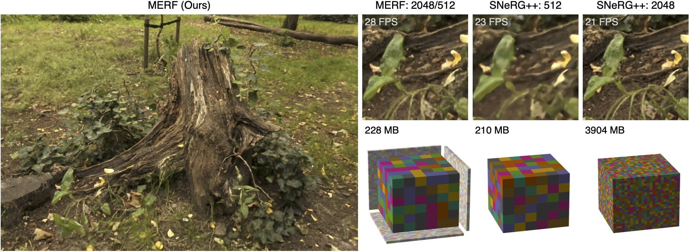

# MERF: Memory-Efficient Radiance Fields for Real-time View Synthesis in Unbounded Scenes

## [Project Page](https://creiser.github.io/merf) | [Video](https://youtu.be/3EACM2JAcxc) | [Arxiv](https://arxiv.org/abs/2302.12249)

This is the official code release for the SIGGRAPH 2023 project [**MERF:
Memory-Efficient Radiance Fields for Real-time View Synthesis in
Unbounded Scenes**](https://creiser.github.io/merf). The code is written in
[JAX](https://github.com/google/jax). Contact
[Christian Reiser](https://creiser.github.io) in case you have any questions.



<iframe width="560" height="315" src="https://www.youtube.com/embed/3EACM2JAcxc" frameborder="0" allowfullscreen></iframe>

### Abstract
Neural radiance fields enable state-of-the-art photorealistic view synthesis.
However, existing radiance field representations are either too
compute-intensive for real-time rendering or require too much memory to scale to
large scenes. We present a Memory-Efficient Radiance Field (MERF) representation
that achieves real-time rendering of large-scale scenes in a browser. MERF
reduces the memory consumption of prior sparse volumetric radiance fields using
a combination of a sparse feature grid and high-resolution 2D feature planes.
To support large-scale unbounded scenes, we introduce a novel contraction
function that maps scene coordinates into a bounded volume while still allowing
for efficient ray-box intersection. We design a lossless procedure for baking
the parameterization used during training into a model that achieves real-time
rendering while still preserving the photorealistic view synthesis quality of a
volumetric radiance field.

### How to run the code?
- Download and unzip mipnerf360 dataset:\
  ```
  curl -O http://storage.googleapis.com/gresearch/refraw360/360_v2.zip
  unzip 360_v2.zip
  ```
- Install conda from
https://docs.conda.io/en/latest/miniconda.html#linux-installers
- Create conda environment:\
`conda create --name merf python=3.9 pip`
- Activate conda environment:\
`conda activate merf`
- Install Python dependencies:\
`pip install -r requirements.txt`
- Install pycolmap:\
`git clone https://github.com/rmbrualla/pycolmap.git ./internal/pycolmap`
- Train, bake, evaluate and export to a webviewer-compatible format:\
`./train.sh`\
You can specify the name of the scene that you want to reconstruct, the path
where the dataset is located, and the path to which outputs should be saved
in `./train.sh`
paths to the dataset and the directory outputs should be written to in `train.sh`.
- Download third-party dependencies for the webviewer:\
  ```
  cd webviewer
  mkdir -p third_party
  curl https://unpkg.com/three@0.113.1/build/three.js --output third_party/three.js
  curl https://unpkg.com/three@0.113.1/examples/js/controls/OrbitControls.js --output third_party/OrbitControls.js
  curl https://unpkg.com/three@0.113.1/examples/js/controls/PointerLockControls.js --output third_party/PointerLockControls.js
  curl https://unpkg.com/png-js@1.0.0/zlib.js --output third_party/zlib.js
  curl https://unpkg.com/png-js@1.0.0/png.js --output third_party/png.js
  curl https://unpkg.com/stats-js@1.0.1/build/stats.min.js --output third_party/stats.min.js
  ```
- Host the webviewer locally:\
`python -m http-server`

### Adjustments for single GPU training
For the paper we trained all models on nodes with eight V100 GPUs with 16
GiB of VRAM, which takes about two hours per scene. As a result we can use a
very large batch size (2^16). We are aware that most people prefer single GPU
training but with a single GPU such a large batch size leads to OOM errors.
We enabled gradient accumulation by default
(`Config.gradient_accumulation_steps = 8`) to make it possible to train with the
same batch size that was used for the paper on a single GPU. If you have a card
with less than 16 GiB memory you need to increase
`Config.gradient_accumulation_steps`.


