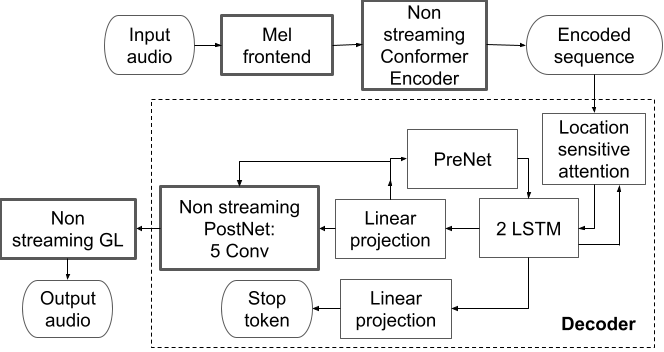
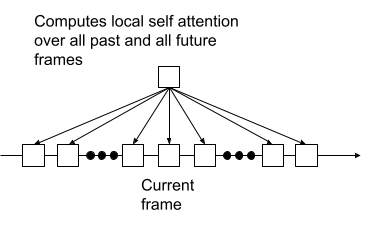
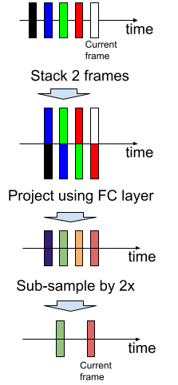
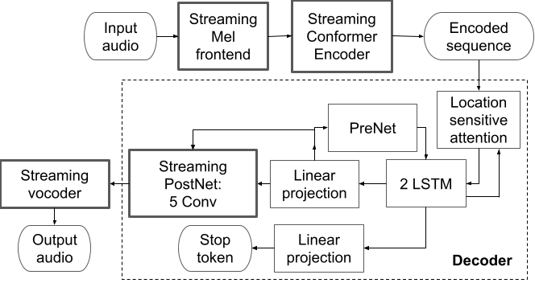
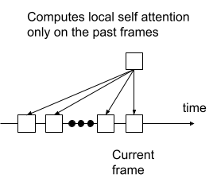
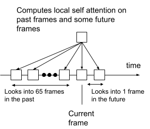

Examples of input/output audio data generated with models from paper [Streaming Parrotron for on-device speech-to-speech conversion](https://arxiv.org/abs/2210.13761).

VCTK data [license](https://datashare.ed.ac.uk/bitstream/handle/10283/3443/license_text?sequence=3&isAllowed=y)
|  Audio files      | Description  |
| ---------------- | --------------------- |
|[Input](vctk/input) | Input data containing clean audio clips from VCTK data.     |
|[nEnc_nDec_nGL](vctk/nEnc_nDec_nGL) | Model with non streaming encoder, non streaming decoder and non streaming Griffin Lim.  |
|[LSA LS2(int8),sDec(int8)+GL](vctk/stR764CR44_int8_sDec_int8_sGL1) | Model with quantized int8 streaming encoder LSA_LS2, quantized int8 streaming decoder and streaming vocoder Griffin Lim sGL1 (in this paper, it corresponds to audio examples Table 5: LSA LS2 int8, sDec int8 with GL).  |
|[LSA_LS2(int8)+sDec(int8)+MG](vctk/stR764CR44_int8_sDec_int8_sMelGan1) | Model with quantized int8 streaming encoder LSA_LS2, quantized int8 streaming decoder and streaming neural vocoder sMelGan1 (in this paper, it corresponds to audio examples from Table 5: LSA LS2 int8, sDec int8 with MG).  |

We preserved audio clip names from VCTK dataset.

# Supplementary model diagrams:
All below models and blocks are described in our paper with text. Here we provide additional visual diagrams.

## Base non streaming parrotron model

Base non streaming parrotron model from [paper](https://ieeexplore.ieee.org/document/9414644) is shown on Fig.1. By bold lines we highlighted blocks which we converted to streaming mode in our [paper](https://arxiv.org/pdf/2210.13761.pdf), so that we can run Parrotron in streaming mode.

Fig. 1 Base non streaming Parrotron model.

On Fig. 2 we show diagram of "Non streaming Conformer Encoder" of the base model from [paper](https://ieeexplore.ieee.org/document/9414644)

Fig. 2 Base Non streaming Conformer Encoder.

Conformer block is described in [paper](https://arxiv.org/pdf/2005.08100.pdf). Non streaming conformer block computes local self attention over all frames of the input sequence, as shown on Fig. 3

Fig. 3 Non streaming local self attention uses all frames in the past and the future frames.

Diagram of "Causal Stack 2 frames and sub-sample by 2x" is shown on Fig. 4.

Fig. 4 Diagram of "Causal Stack 2 frames and sub-sample by 2x".

## Streaming Parrotron model
Streaming Parrotron model is shown on Fig. 5

Fig. 5 Streaming Parrotron model.

Conversion of non streaming "Mel frontend" to "Streaming Mel frontend"(we made mel frontend causal) does not impact model accuracy.
In our paper we showed that conversion of "Non streaming PostNet: 5 Conv" to "Streaming PostNet: 5 Conv"(we made all conv layer causal) does not impact model accuracy.
In our [paper](https://arxiv.org/pdf/2203.00756.pdf) we showed that conversion of non streaming Griffin Lim vocoder to streaming vocoder (based on Griffin Lim or MelGAN) does not impact model accuracy.
Conversion of "Non streaming Conformer Encoder" to "Streaming Conformer Encoder"(we made all layers causal) impacts accuracy a lot as shown in [paper](https://arxiv.org/pdf/2210.13761.pdf). It is the main focus of this research. In addition we proved that we can run our model with 2x real time factor on mobile phone CPU (and showed that quantization is important for achieving our goal).

### Causal streaming encoder
On Fig. 6 we show diagram of *Causal* "Streaming Conformer Encoder" of Streaming Parrotron model from our [paper](https://arxiv.org/pdf/2210.13761.pdf). It is built using the following layers: Causal conformer blocks that have access to only
65 hidden-states form the left (i.e., left context of 65); Causal Stacker which stacks 2 frames project them back to original dimension of one frame and then and sub-sample them by 2x in time dimension.

Fig. 6 Causal streaming Conformer Encoder.

The main component of Conformer block is local self attention. Streaming causal local self attention as shown on Fig. 7, it computes self attention only on the past frames.

Fig. 7 Streaming Causal local self attention.

### Streaming encoder using look-aheads: streaming aware non-causal conformer block with self-attention looking at the left 65 hidden-states and a limited look ahead of the right/future.
On Fig. 6 we show diagram of *Causal* "Streaming Conformer Encoder" of Streaming Parrotron model from our [paper](https://arxiv.org/pdf/2210.13761.pdf). It is built using the following layers: Causal conformer blocks that have access to only
65 hidden-states form the left (i.e., left context of 65); Causal Stacker which stacks 2 frames project them back to original dimension of one frame and then and sub-sample them by 2x in time dimension.

### Streaming encoder using look-aheads: streaming aware Stacker Layers with different number of look-aheads.

*LSA1* streaming Conformer encoder is shown on Fig. 8. It is composed of sequence of 2 causal conformer blocks, one stacker with subsampling, 2 cusal conformer blocks, one stacker with subsampling, 3 causal conformer blocks, one non causal conformer block (with 5 frames lookahead R=5), 9 causal conformer blocks.
*LSA2* streaming Conformer encoder is shown on Fig. 9. 

Fig. 8 *LSA1* streaming Conformer Encoder.

Fig. 9 *LSA2* streaming Conformer Encoder.

The main component of non causal conformer block is non causal local self attention. Streaming non causal local self attention as shown on Fig. 10, it computes self attention on 65 past frames and 5 frames in the future (R=5, also called right context).

Fig. 10 Streaming non causal local self attention.

### Streaming encoder using look-aheads: combining both types of look-aheads: self-attention look-ahead and look-ahead stacker.

