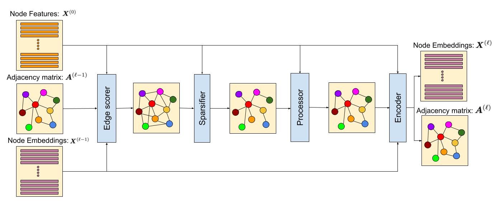

# UGSL: A Unified Framework for Benchmarking Graph Structure Learning

This is the official repository for our paper, `UGSL: A Unified Framework for Benchmarking Graph Structure Learning`.
The repo contains a unified framework with different components in it for graph structure learning models.

## What is UGSL?

Graph neural networks (GNNs) demonstrate outstanding performance in a broad range of applications. While the majority of GNN applications assume that a graph structure is given, some recent methods substantially expanded the applicability of GNNs by showing that they may be effective even when no graph structure is explicitly provided. The GNN parameters and a graph structure are jointly learned. Previous studies adopt different experimentation setups, making it difficult to compare their merits. In this paper, we propose a benchmarking strategy for graph structure learning using a unified framework. Our framework, called Unified Graph Structure Learning (UGSL), reformulates existing models into a single model. We implement a wide range of existing models in our framework and conduct extensive analyses of the effectiveness of different components in the framework. Our results provide a clear and concise understanding of the different methods in this area as well as their strengths and weaknesses.




## Datasets

We ablate various UGSL components and hyperparameters across six different datasets from various domains. The first class of datasets consists of the three established benchmarks in the GNN literature namely *Cora*, *Citeseer*, and *Pubmed* [1]. For these datasets, we only feed the node features to the models without their original graph structures (edges). 
We also experiment with Amazon Photos (or Photos for brevity) [2] which is a segment of the Amazon co-purchase graph [3] with nodes representing goods. We only used the node features for this dataset as well. 
The other two datasets are used extensively for classification with no structure known in advance. One is an Image classification dataset Imagenet-20 (or Imagenet for brevity), a subset of Imagenet containing only 20 classes (totaling 10,000 train examples). We used pre-trained Vision Transformer feature extractor [4]. The last dataset is a text classification dataset Stackoverflow [5].

The statistics of datasets used in the experiments are as follows.


| Dataset                  | Nodes     | Edges     | Classes   | Features   | Label rate  |
| :-------:                | :-------: | :-------: | :-------: | :-------:  | :-------:   |
| Cora                     | 2,708     | 10,858    | 7         | 1,433      | 0.052       |
| Citeseer                 | 3,327     | 9,464     | 6         | 3,703      | 0.036       |
| Pubmed                   | 19,717    | 88,676    | 3         | 500        | 0.003       |
| Amazon-electronics-photo | 7,650     | 143,663   | 8         | 745        | 0.1         |
| Imagenet:20              | 11,006    | 0         | 20        | 1,024      | 0.72        |
| Stackoverflow            | 19,980    | 0         | 21        | 768        | 0.1         |


## Usage

### Installation

Download the code (e.g., via git clone or direct download).

You can first install requirements as:

```sh
python -m pip install requirements.txt
```


### Your first run

First, let us define the environment variable `$BIN` to be our executable

```sh
BIN=python main.py
```

Of course, you may set this in accordance with your setup (e.g., if you use `python3`, `anaconda`, or have additional custom flags).

Then, run your first experiment, with:
```sh
$BIN
```

### Custom models and datasets

The file `config.py` contains the default configuration: trains a GCN encoder on *cora*, with graph structure being learned via an *MLP edge-scorer* and a *KNN sparsifier*.

You may override, e.g., the dataset with:

```sh
$BIN --config.dataset.name amazon_photos
```

You may also provide another python file that contains many different modifications. For instance, copy `config.py` onto (e.g.) `path/to/new_config.py` and modify it, as you wish. Then you can run like:

```sh
$BIN --config path/to/new/config.py
```

You may still override any config variable, e.g., to use the fully-parameterized edge-scorer:

```sh
$BIN --config path/to/new/config.py --config.model.edge_scorer_cfg.name=fp
```
Regardless of the `model.edge_scorer_cfg` utilized in `path/to/new/config.py`, the value passed to the command-line takes precedence.

## Contact us
Most authors of this paper are co-owners of TF-GNN, and we are committed to maintaining the UGSL library and ensuring its compatibility with future versions of TF-GNN.

For questions or comments about the implementation and UGSL, please contact baharef@google.com. For other questions related to TF-GNN, please contact dzelle@google.com. 

## Disclaimer

This is not an official Google product.

## References
[1] Sen, Prithviraj, et al. "Collective classification in network data." AI magazine 29.3 (2008): 93-93.

[2] Shchur, Oleksandr, et al. "Pitfalls of graph neural network evaluation." arXiv preprint arXiv:1811.05868 (2018).

[3] McAuley, Julian, et al. "Image-based recommendations on styles and substitutes." Proceedings of the 38th international ACM SIGIR conference on research and development in information retrieval. 2015.

[4] Dosovitskiy, Alexey, et al. "An image is worth 16x16 words: Transformers for image recognition at scale." arXiv preprint arXiv:2010.11929 (2020).

[5] Xu, Jiaming, et al. "Self-taught convolutional neural networks for short text clustering." Neural Networks 88 (2017): 22-31.
